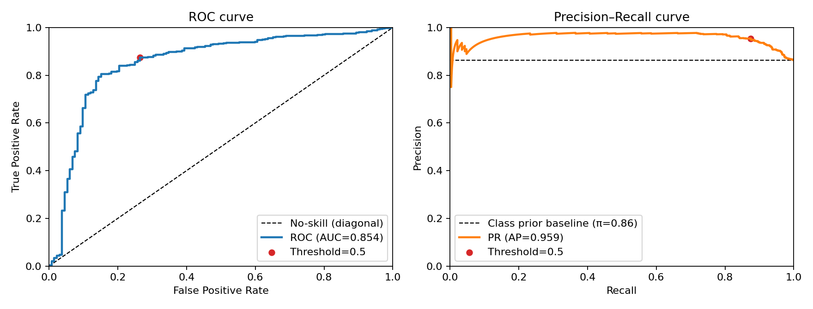
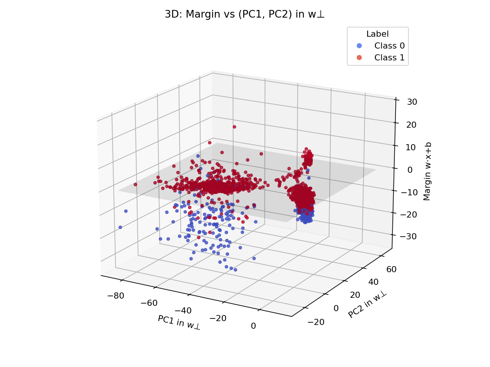
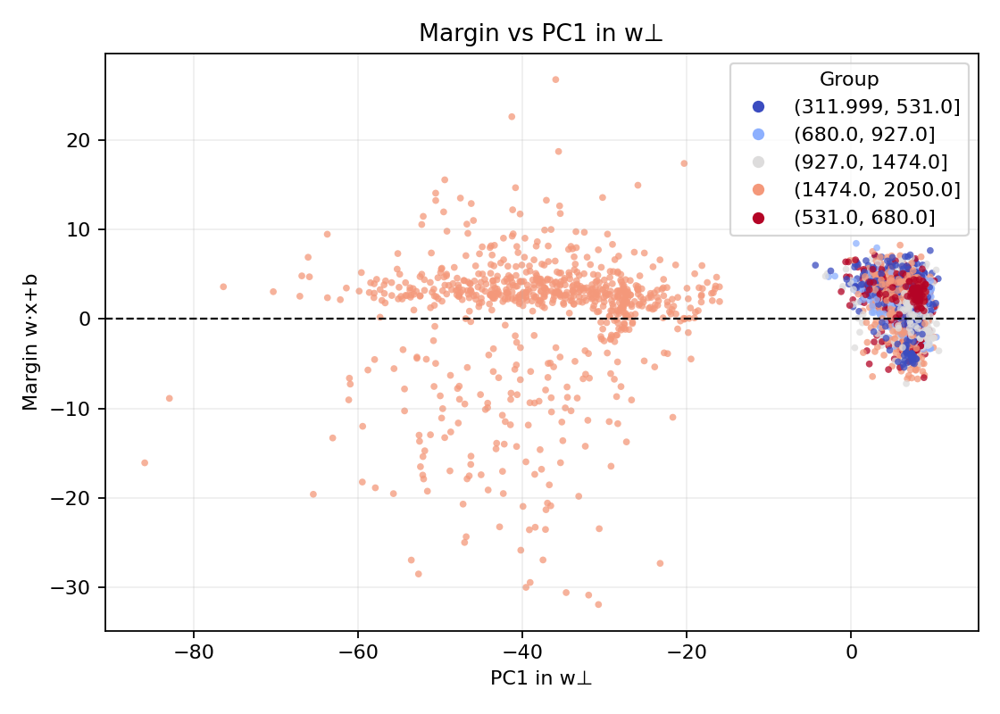
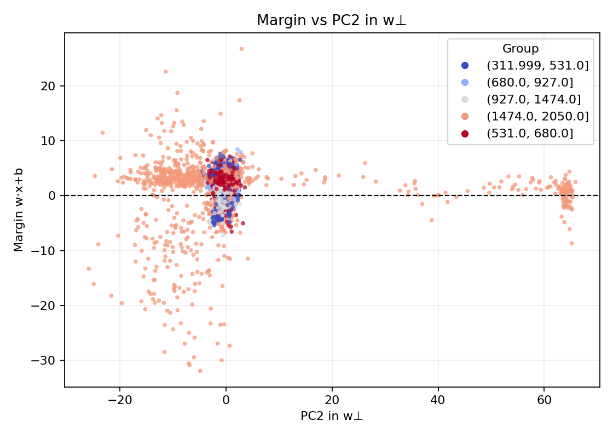

# Uncertainty Directions in Reasoning LLMs

Can a reasoning model’s hidden state reveal whether its final answer will be correct?

This repository is a small probing investigation into whether the residual stream of a reasoning model contains a linearly decodable signal for answer correctness. I extract hidden states from `DeepSeek-R1-Distill-Llama-8B` reasoning traces on MATH-500, label each answer as correct or incorrect using `math-verify`, and train a linear probe to predict correctness from the final-layer hidden state at the `</think>` token.

The main result is that a simple linear probe can predict answer correctness substantially better than chance, suggesting that the model’s residual stream contains a direction correlated with whether its reasoning trace will end in a correct answer.

## Summary

* **Model:** `DeepSeek-R1-Distill-Llama-8B`
* **Dataset:** Random subset / rollouts from MATH-500
* **Hidden state:** Final-layer residual stream at the `</think>` token
* **Labeling:** Correctness labels from `math-verify`, with some modifications
* **Probe:** Linear classifier over 4096-dimensional hidden states
* **Samples:** 4,817 hidden-state vectors
* **Main question:** Is correctness linearly decodable from the model’s reasoning-state representation?

## Results

The dataset is imbalanced because the model answers roughly 86% of the retained examples correctly, so accuracy alone is not the main metric. I report AUROC, AUPRC, and F1 with stratified bootstrap confidence intervals.

| Metric | Value |         95% CI | Permutation p-value |
| ------ | ----: | -------------: | ------------------: |
| AUROC  | 0.854 | [0.813, 0.890] |              0.0001 |
| AUPRC  | 0.959 | [0.940, 0.975] |              0.0001 |
| F1     | 0.913 | [0.899, 0.926] |                   — |

The saved cross-validation sweep in `cv_f1_table.csv` reports a best mean test F1 of roughly **0.894**, while the final bootstrap analysis reports **0.913 F1** on the evaluated split.

These results suggest that the final `</think>` representation contains a strong linear signal for answer correctness. This should not be interpreted as proof that the model has a clean internal “knows it is correct” feature, but it is good evidence that correctness is represented in a simple direction or subspace.

## Method

For each generated reasoning trace:

1. Run the model on a MATH-500 problem.
2. Keep the sample only if the model produces an answer within the 2048-token budget.
3. Use `nnsight` to extract the final-layer hidden state at the `</think>` token.
4. Use `math-verify` to label the final answer as correct or incorrect.
5. Train a linear classifier on the extracted hidden states.
6. Analyze the classifier margin and possible confounds such as response length, problem subject, and difficulty.

The learned linear probe defines a direction `w` in residual-stream space. For a hidden state `h`, the probe margin is:

```text
margin(h) = w · h + b
```

I refer to this direction informally as an **uncertainty direction**, though a more cautious name would be a **correctness-predictive direction**. Positive and negative margins correspond to the two sides of the classifier boundary.

## Visualizations

The main visualization projects each hidden state into a 2D/3D slice of the residual stream.

The probe direction defines the classifier margin: how far a hidden state is from the linear decision boundary. I then look at principal components in the subspace orthogonal to this probe direction, which helps separate the correctness-predictive direction from other high-variance directions in the residual stream.

### Probe performance

<p align="center">
  
</p>

### Margin vs orthogonal principal components

<p align="center">
  
</p>

## Confound checks

I checked whether the probe was simply learning obvious surface-level correlates.

### Response length

Response length had only a weak relationship with the probe margin:

```text
Spearman(margin, length):  r = -0.097, p = 1.36e-11
```

However, length was more strongly correlated with one of the principal components in the subspace orthogonal to the probe direction:

```text
Spearman(PC1⊥, length):    r = -0.377, p = 4.02e-162
Spearman(PC2⊥, length):    r = -0.093, p = 8.10e-11
```
<p align="center">
  
</p>

<p align="center">
  
</p>

This suggests that length is present in the representation, but it does not appear to explain the main correctness margin.

### Problem subject

Problem category had a measurable effect on the margin:

```text
ANOVA(margin ~ subject)
Groups: 7
F = 68.218
p = 9e-82
eta² = 0.0784
omega² = 0.0773
```

So the probe may partially pick up subject-specific structure, but subject does not fully explain the correctness signal.

### Difficulty

Difficulty was also considered as a possible confound. In this run, it did not appear to explain the probe margin strongly enough to account for the result.

## Interesting failure mode

Some of the most confident incorrect examples were qualitatively interesting. In several of them, the model initially recognized that it had made a mistake, but then abruptly lost track of the original goal and continued confidently with an incorrect line of reasoning.

For example, in one geometry problem, the model noticed an inconsistency in an intermediate calculation, but then switched methods and implicitly assumed a quantity that did not answer the original question. This kind of trace suggests that the model can sometimes contain evidence of uncertainty or inconsistency while still ending in a confident incorrect answer.

These examples are useful for future causal experiments: if the probe direction really tracks something like uncertainty or correctness, intervening on it may affect self-correction behavior.

## Repository structure

```text
.
├── README.md
├── pyproject.toml
├── uv.lock
├── probe.ipynb
├── rollout.ipynb
├── qwen1.5rollouts.ipynb
├── X_4096.npy
├── y_labels.npy
├── uids.npy
├── linear_probe.joblib
├── classification_plane.npz
├── margin_direction_t.pt
├── projection_w_perp.npy
├── cv_f1_table.csv
├── misclassified_examples.csv
├── roc_pr_curves.png
├── projection_margin_vs_pc12_3d.png
├── projection_margin_vs_pc12_3d_by_length.png
├── projection_margin_vs_pc1_by.png
├── projection_margin_vs_pc1_by_length.png
├── projection_margin_vs_pc2.png
└── projection_margin_vs_pc2_by_length.png
```

## Setup

This project uses `uv`.

```bash
uv sync
```

The main dependencies include:

* `nnsight`
* `datasets`
* `math-verify`
* `scikit-learn`
* `torch`
* `skorch`
* `seaborn`
* `jupyter`

You will also need access to the relevant model weights and enough GPU memory to run hidden-state extraction.

## Reproducing the experiment

The current version is notebook-based.

1. Generate model rollouts on MATH-500.
2. Extract hidden states at the `</think>` token using `nnsight`.
3. Save hidden states to `X_4096.npy`.
4. Save correctness labels to `y_labels.npy`.
5. Run `probe.ipynb` to train the linear probe and generate plots.

The saved artifacts in this repo allow analysis to be repeated without regenerating all model rollouts.

## Limitations

This is an exploratory probing experiment, not a complete mechanistic explanation.

Important limitations:

* The dataset is imbalanced because the model answers most retained questions correctly.
* The permutation test preserves class labels but does not necessarily control for all structure in the dataset, such as problem type or difficulty.
* If multiple rollouts from the same problem are present, a stricter grouped split by problem ID should be used to avoid train/test leakage across variants of the same question.
* A linear probe can show that information is decodable, but not whether the model causally uses that direction during generation.
* The “uncertainty direction” name is suggestive; the direction may encode correctness, confidence, entropy, subject, difficulty, or a mixture of these factors.

## Future directions

There are several natural next steps:

1. **Grouped evaluation:** Re-run the probe with grouped train/test splits by problem ID.
2. **Entropy baseline:** Compare the probe against token-level entropy, answer probability, and other confidence baselines.
3. **Causal intervention:** Ablate or amplify the probe direction during generation and measure whether correctness or self-correction changes.
4. **Layer sweep:** Check where in the network the correctness signal first becomes linearly decodable.
5. **Token sweep:** Test whether the signal appears before `</think>`, especially around moments where the model recognizes mistakes.
6. **Mechanistic analysis:** Investigate which components write to this direction and whether RMSNorm/MLP/attention pathways are involved.
7. **Cross-dataset generalization:** Train on MATH-500 and evaluate on GSM8K, AIME-style problems, or other reasoning datasets.
8. **Cross-model generalization:** Test whether a similar direction exists in other reasoning models.

## Takeaway

A simple linear probe trained on final-layer `</think>` hidden states predicts whether a reasoning model’s answer is correct with strong performance. The result is not yet a causal story, but it is a useful starting point for studying how reasoning models represent uncertainty, correctness, and self-correction internally.
